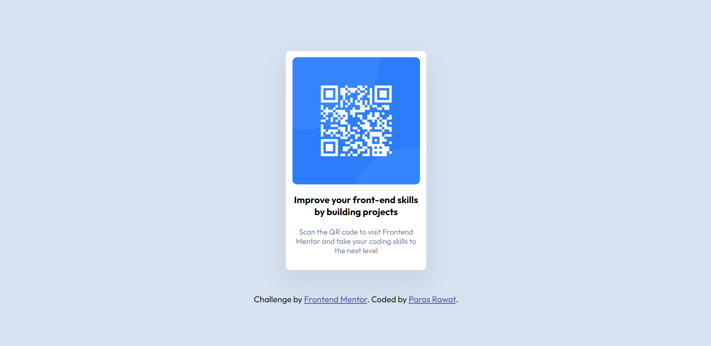

# Frontend Mentor - QR code component solution

This is a solution to the [QR code component challenge on Frontend Mentor](https://www.frontendmentor.io/challenges/qr-code-component-iux_sIO_H).

### Screenshot

### Links

- Live Site URL: [https://qr-component-07.netlify.app/]

=

### Built with

- Semantic HTML5 markup
- CSS custom properties
- Flexbox
- CSS Grid
